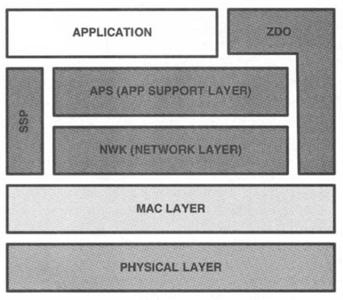

# Wireless Communication System using Xbee
## Abstract

## Objective
Establish a connection between a transmitter and a receiver by building a wireless communication system using Xbee.

## Theoretical Framework

### Architecture
The typical ZigBee architecture can be organized in seven distinct layers, where the two on the bottom corresponds to the IEEE 802.15.4 standard; the rest of these layers allows the creation of a mesh network that makes use of the 802.15.4 radio links.



The 802.15.14 standard provides 16 channels on the 2.4GHz band, these channels are numbered from 11 to 26. Since ZigBee only uses the nonbeacon-enabled mode of 802.15.4, there is no possibility to access the network in a deterministically mode nor to reserve bandwidth. Furthermore, ZigBee restricts PAN IDs in the range of 0x0000 to 0x3FFF; this is only a subset of the 802.15.4 range.

#### ZigBee Node Types

- ZigBee End Device (ZED):

  This node is designed with a battery operated life, usually with a low duty cycle. This implies that this device spends most of its time in a sleep state, and must join a network trough a router node.  

- ZigBee Router (ZR):

  This node acts as packet router, and must be permanently listening once they join a network.

- ZigBee Coordinator (ZC):

  ZigBee Coordinator are able to create a network or join one, if they join one, they act as a ZigBee router. These devices contain the trust center, which is responsible of management of security keys and the admission or declination of new nodes.

### Protocols
#### Application Support Sublayer (APS) 
The APS is in charge of several things, first of all the multiplexing and demultiplexing of the network layer messages, this layer forwards them into their appropriate application object (using the endpoint ID). Besides, this layer records nodes and endpoints in a binding table. Perhaps the most important feature, is that it is responsible for the management of security keys.

#### ZigBee Device Object (ZDO)
The ZDO layer is responsible of the endpoint0 application and manage the state of the ZigBee node, it is designed to discover nodes and join networks, as well as additional primitives supporting the concept of binding.

#### ZigBee Cluster Library (ZCL)
This layer consist of a library of functions that can be used in application profiles, public or private. It provides the network group formation and management. It is considered as one of the key assets of ZigBee.

#### Application Framework
Here, in the application framework, a single Endpoint ID is assigned. Also, an API environment is provided to ZigBee application developers.

### Physical Layer
REEEEEEEEEEEEEEEEEEEEEEEEEEEEEEEEEE

### MAC Sublayer Protocol
REEEEEEEEEEEEEEEEEEEEEEEEEEEEEEEEEE X2

### Frame Structure
In the ZigBee technology, the frames are transported as 802.15.4 payload. This format is illustrated as follows:
- Frame Control

  In the frame control are specified the type of package that is sent. These are the different parameters that can be specified: frame type, protocol version, route discovery, multicast, security, source route,destination IEEE address, and source IEEE address. It is important to mention that these parameters are only informational, no actual data is in this field.

- Destination Address

  In the destination field, we can specify where we are sendiong our packet: 0xffff broadcast to all node (this includes sleeping devices), 0xfffd broadcast to all awake devices, and 0xfffc broadcast only to routers.

- Source Address

  Here we can find the source address.

- Radious

  The radious defines the maximum number of hops allowed for this packet.

- Sequence Number

  This is the rolling counter.

- Payload

  The payload is our actuall APS data. However, we can also find network layer commands.

## Materials
* 2 XBee devices of the same model (S1, S1 Pro, S2, S2 Pro or S2C)
* 2 XBee explorer dongles
* 2 Raspberry PIs with Raspbian installed and Internet access
* XCTU software installed from https://www.digi.com/products/xbee-rf-solutions/xctu-software/xctu

## Procedure
Insert both XBee to the XBee explorers and connect them to the COM ports of your computer. Open the XCTU software and press the upper left magnifying glass button to discover the XBee devices connected to the computer. Select all COM ports and keep pressing "Next" with the default parameters to find the devices, and add them. Click on on of the devices from the left side list to open its configuration panel on the right. There are some parameters to be modified in XCTU to enable communication between both XBees, such as the PAN ID, Channel, Destination Address and Coordinator Mode. There is an extra parameter that changes depending on the model of the Xbees. First, the common parameters for all models will be explained:

For the Coordinator XBee:
* Channel is the same as the End Device/Router Xbee. Can be left as the default value C.
* PAN ID is also the same as the other XBee. In this case, it was left as 1234.
* Coordinator Mode is enabled.
* Destination Address Low is FFFF (Broadcast).

For the End Device/Router XBee:
* Channel is the same as the End Device/Router Xbee. Can be left as the default value C.
* PAN ID is also the same as the other XBee. In this case, it was left as 1234.
* Coordinator Mode is disabled
* Destination Address Low is 0 (Point to network's coordinator).

JV, MY


### Electric Circuit
### Software
### Communication

```
 INSERTAR CODIGOS #1
```

```
 INSERTAR CODIGOS #2
```

## Results and Analysis
Once both of the XBee devices are correctly configured, it is time to connect the into separate Raspberry Pi. As the two codes start running, the link between the the coordinator and the end device will be stablished and an endpoint ID will be assigned. After this, the communication starts to occur.
```
When the Client connects its socket to the host, the message Hello World! is sent. At this time, the Server print the received data as:
received [Hello World!]
```
Clearly, communication takes place between our XBee devices. 

## Conclusions
As we can see, ZigBee/XBee technology makes use of several attributes of 802.15.4 environment. However, it is its own environment and it must be treated as an important contribution to the wireless communication spectrum.

There are limited real life systems that actually incorporate ZigBee/XBee technology. This might be center at the fact that more powerful and evolved forms of communication are commonly used (such as WiFi or Bluetooth). Despite this, ZigBee/XBee technology is not obsolete; it is growing and developing. We can contribute its development, creating systems of our own and taking advantage of its characteristics.

## References
[1] https://internetofthingsagenda.techtarget.com/definition/RFID-radio-frequency-identification

[2] Tanenbaum, A., Wetherall, D. (2011). Computer Networks. (pp. 327-328). 

[3] https://internetofthingsagenda.techtarget.com/definition/RFID-radio-frequency-identification

[4] Tanenbaum, A., Wetherall, D. (2011). Computer Networks. (pp. 329).

[5] EPC Global Standard

[6] Hersent, O., Boswarthick, D., & Elloumi, O. (2011). The internet of things : key applications and protocols. Retrieved from https://ebiblio.cetys.mx:4153

[7] Eady, F. (2010). Hands-on zigbee : implementing 802. 15. 4 with microcontrollers. Retrieved from https://ebiblio.cetys.mx:4153
